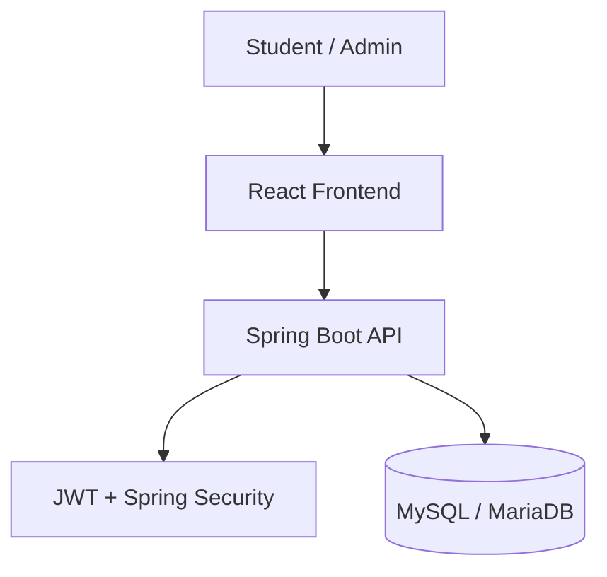
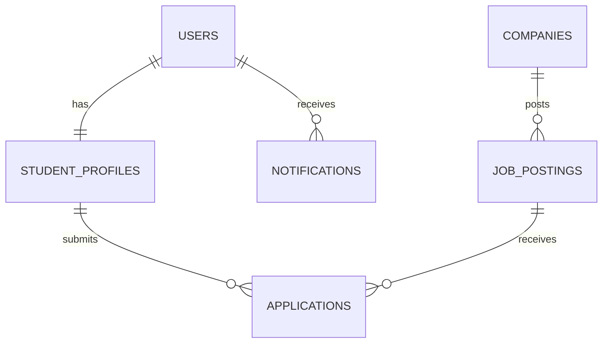

# Project Report

On
“STUDENT PLACEMENT TRACKING PORTAL”

Submitted in partial fulfilment of the requirements for the Degree of
**MASTER OF COMPUTER APPLICATION**

By
**[STUDENT NAME 1]** [REGISTRATION NO.]
**[STUDENT NAME 2]** [REGISTRATION NO.]
**[STUDENT NAME 3]** [REGISTRATION NO.]

Under the Guidance of
**[GUIDE NAME]**

[DEPARTMENT NAME]
[COLLEGE / UNIVERSITY NAME]
[PLACE - PINCODE]
SESSION: [SESSION]

---

# CERTIFICATE

This is to certify that the project work entitled “STUDENT PLACEMENT TRACKING PORTAL” is submitted by [STUDENT NAME(S)] to [UNIVERSITY / COLLEGE NAME] in partial fulfilment of the award for Master of Computer Application, is a bona fide project work carried out by them under my supervision. The results presented in this project have not been submitted elsewhere for the award of any other degree.

In my opinion, this work has reached the standard fulfilling the requirements for the award of the degree in accordance with the regulations of the institution.

Signature of Guide Signature of H.O.D.
[GUIDE NAME] [H.O.D. NAME]

Signature of External Examiner

---

# DECLARATION

We declare that this written submission represents our ideas with our own words and where others’ ideas or words have been included, we have adequately cited and referenced the original sources. We also declare that we have adhered to all principles of academic honesty and integrity and have not misrepresented or fabricated any idea, data, fact, or source in our submission.

| Sl. No. | Name   | Registration No. | Signature |
| ------- | ------ | ---------------- | --------- |
| 1       | [NAME] | [REG NO.]        |           |
| 2       | [NAME] | [REG NO.]        |           |
| 3       | [NAME] | [REG NO.]        |           |

Date:

---

# ACKNOWLEDGEMENT

With immense pleasure and heartfelt gratitude, we express our sincere appreciation to all those who played a vital role in the successful completion of this project. This journey has been both enriching and inspiring, and it would not have been possible without the support and guidance we received along the way.

We extend our deep thanks to the Department, our Head of Department, and our Project Guide for providing the platform, encouragement, and academic environment required to complete this work successfully.

We are profoundly grateful to our guide for the insightful mentorship, thoughtful suggestions, and constant encouragement that helped us turn the project idea into reality.

[STUDENT NAME 1]
[STUDENT NAME 2]
[STUDENT NAME 3]

---

# ABSTRACT

The Student Placement Tracking Portal is a full-stack campus recruitment management system designed to centralize and simplify the placement process for colleges. It provides role-based access for administrators and students, enabling company management, job posting, student profile handling, job applications, and application status tracking in one platform. The system replaces manual spreadsheets and fragmented communication with a secure web application.

The backend is built with Spring Boot 3.2.4 and Java 17, while the frontend uses React 18 with Vite and Tailwind CSS. Authentication is handled using JWT and Spring Security, and data is stored in MySQL or MariaDB through Spring Data JPA.

**Keywords:** React, Spring Boot, Java, JWT, MySQL, MariaDB, Tailwind CSS

---

# CONTENTS

| CHAPTER NO.     | TITLE                       | PAGE NO. |
| --------------- | --------------------------- | -------- |
| ABSTRACT        |                             | i        |
| LIST OF FIGURES |                             | ii       |
| LIST OF TABLES  |                             | iii      |
| 1               | INTRODUCTION                | 1        |
| 1.1             | PURPOSE                     | 1        |
| 1.2             | PROJECT SCOPE               | 2        |
| 2               | LITERATURE REVIEW           | 3        |
| 3               | PROBLEM STATEMENT           | 4        |
| 4               | SYSTEM ANALYSIS             | 5        |
| 5               | TECHNOLOGY STACK            | 8        |
| 6               | SYSTEM DESIGN               | 10       |
| 7               | IMPLEMENTATION              | 13       |
| 8               | TESTING AND DEPLOYMENT      | 18       |
| 9               | CONCLUSION AND FUTURE SCOPE | 20       |

---

# LIST OF FIGURES

| FIGURE NO. | FIGURE NAME                   | PAGE NO. |
| ---------- | ----------------------------- | -------- |
| 1.1        | System Architecture           | 10       |
| 2.1        | Database Relationship Diagram | 11       |
| 3.1        | Student Application Flow      | 14       |

---

# LIST OF TABLES

| TABLE NO. | TABLE NAME         | PAGE NO. |
| --------- | ------------------ | -------- |
| 1.1       | Technology Stack   | 8        |
| 1.2       | Database Tables    | 11       |
| 1.3       | Core API Endpoints | 15       |

---

# 1. INTRODUCTION

The Student Placement Tracking Portal is a web-based application developed to manage the complete campus recruitment process in a structured and secure manner. It supports administrative work such as company registration, job posting, application review, and status updates, while also giving students a clear way to browse jobs, apply, and track outcomes.

## 1.1 PURPOSE

1. To digitalize the placement process and reduce manual paperwork.
2. To provide a central dashboard for placement administrators.
3. To allow students to access job opportunities and application updates.
4. To ensure secure authentication using JWT and role-based access.
5. To maintain placement data in a single database.

## 1.2 PROJECT SCOPE

The project scope includes company management, job drive creation, student profile management, eligibility checking, application submission, application tracking, dashboard analytics, and support handling. The system is designed to be scalable and can be extended with notifications, interview scheduling, and advanced reports in future versions.

---

# 2. LITERATURE REVIEW

The literature around digital placement systems highlights the need for centralized recruitment platforms that reduce manual errors and improve communication between students and placement administrators. Existing systems often focus on either job listing or application tracking, but a complete portal must also include role-based security, eligibility validation, and student-specific workflows.

This project follows modern web development practices using a separated frontend and backend architecture. React provides a responsive user interface, while Spring Boot offers a reliable REST API layer for business logic and data processing.

---

# 3. PROBLEM STATEMENT

Colleges commonly manage placement data using spreadsheets, email threads, and manual status updates. This causes duplication, delays, and confusion for both students and administrators. Students may not know which jobs they are eligible for or what stage their application is in, while admins spend extra time reviewing records and updating statuses manually.

The Student Placement Tracking Portal solves this by providing a centralized system for handling company details, job postings, student applications, and placement status updates.

---

# 4. SYSTEM ANALYSIS

## Overview

The system analysis for the Student Placement Tracking Portal covers the key stages involved in placement management, from user login to job application and administrative review. The system is divided into frontend presentation, backend processing, security handling, and database storage.

## 4.1 User and Data Preparation

- Users are classified into Admin and Student roles.
- Student profile data includes name, roll number, branch, batch year, CGPA, skills, and resume reference.
- Company and job data are maintained by the admin.

## 4.2 Authentication and Security

- Login and registration are handled through JWT-based authentication.
- Spring Security protects admin and student routes separately.
- Passwords are stored in hashed form using BCrypt.

## 4.3 Job Posting and Application Flow

- Admin creates job postings with company details, package, eligibility CGPA, and deadline.
- Students browse active openings and apply only if eligibility conditions are satisfied.
- Each application is stored with a status such as PENDING, SHORTLISTED, REJECTED, or HIRED.

## 4.4 Tracking and Reporting

- Admin dashboard shows total students, total companies, active jobs, and total placed students.
- Students can view their application history and current status.

---

# 5. TECHNOLOGY STACK

## 5.1 Frontend

- React 18.2.0
- Vite 5.2.0
- React Router DOM 6.22.3
- Axios 1.6.8
- Tailwind CSS 3.4.3
- Lucide React 0.372.0
- jwt-decode 4.0.0

## 5.2 Backend

- Java 17
- Spring Boot 3.2.4
- Spring Security
- Spring Data JPA
- Hibernate
- JJWT 0.11.5
- Lombok

## 5.3 Database

- MySQL / MariaDB 10.11.7

---

# 6. SYSTEM DESIGN

The system follows a three-layer design:

1. Presentation Layer: React frontend.
2. Application Layer: Spring Boot REST backend.
3. Data Layer: MySQL/MariaDB database.

## 6.1 Database Design

The schema includes six core tables: users, student_profiles, companies, job_postings, applications, and notifications. The design enforces referential integrity and prevents duplicate applications through a unique constraint on student and job combinations.

---

# 7. IMPLEMENTATION

## 7.1 Authentication and Authorization

The portal uses JWT for stateless authentication. Users sign up or log in through the auth module, and the backend generates a signed token after verifying credentials. Spring Security ensures only authorized users can access role-specific endpoints.

## 7.2 Admin Module

The admin module supports student listing, company management, job posting creation, application review, and dashboard statistics. Admins can update application status based on recruitment progress.

## 7.3 Student Module

The student module allows profile management, browsing available jobs, applying for jobs, and tracking application results. A support page is also included for help and issue reporting.

## 7.4 Core Backend Structure

- Controller layer for REST APIs
- Service layer for business logic
- Repository layer for database access
- Model layer for entities
- Security layer for JWT and role control

---

# 8. TESTING AND DEPLOYMENT

## 8.1 Testing

The system can be tested at both backend and frontend levels. The backend uses Maven-based builds and Spring Boot validation, while the frontend can be tested through Vite build checks and browser-based manual verification of user flows.

## 8.2 Local Deployment

1. Run the database using `run_db.bat`.
2. Run the backend using `run_backend.bat`.
3. Run the frontend using `run_frontend.bat`.
4. Open the application at `http://localhost:5173`.

## 8.3 Cloud Deployment

- Backend: Render or Railway
- Frontend: Vercel or Netlify
- Database: Aiven, PlanetScale, or AWS RDS

---

# 9. CONCLUSION AND FUTURE SCOPE

The Student Placement Tracking Portal successfully converts a manual placement workflow into a secure and organized digital system. It provides clear advantages for both students and administrators by improving visibility, reducing repetitive work, and centralizing data.

Future enhancements may include real-time notifications, resume parsing, interview scheduling, advanced analytics, and live status updates through WebSocket integration.

---

# REFERENCES

- https://spring.io/projects/spring-boot
- https://react.dev
- https://vitejs.dev
- https://tailwindcss.com
- https://docs.spring.io/spring-security/
- https://mariadb.com/kb/en/
