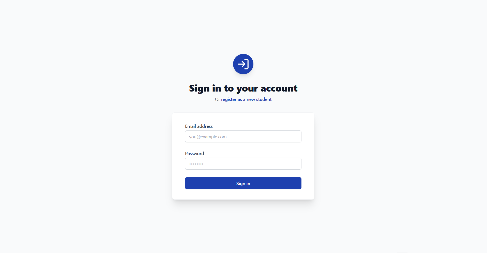
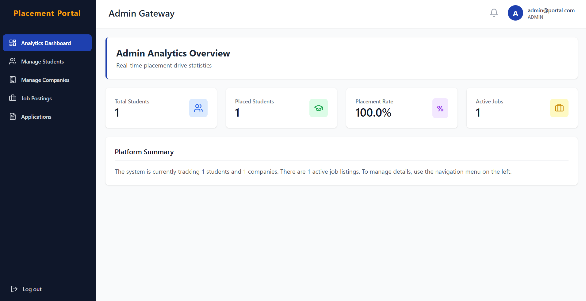
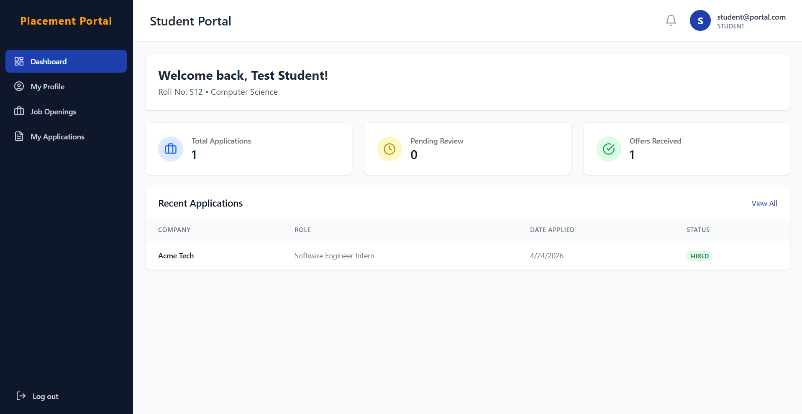
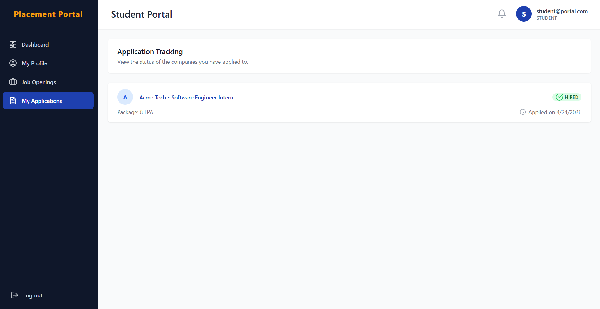
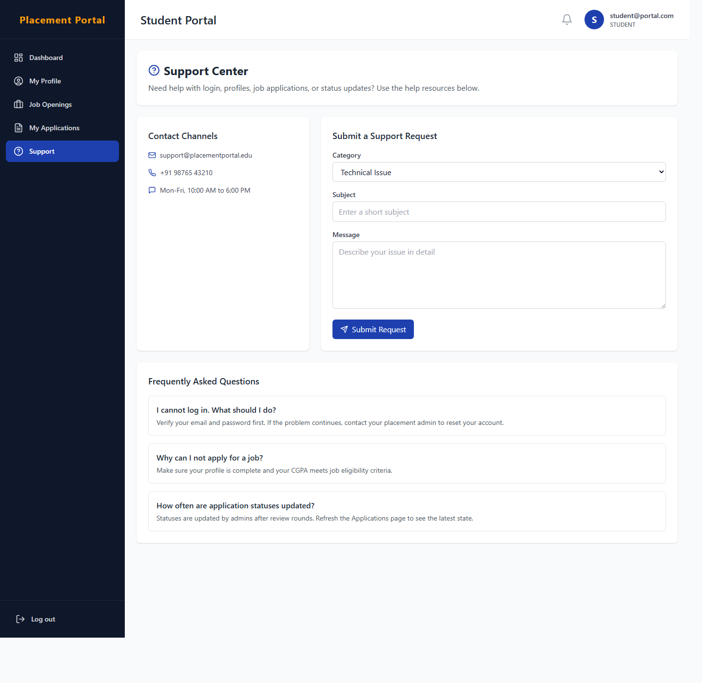

# Student Placement Tracking Portal

A full-stack campus recruitment management system built with Spring Boot, React, and MySQL/MariaDB.

This project helps colleges manage the complete placement workflow:

1. Admin manages companies and job drives.
2. Students view eligible drives and apply.
3. Admin tracks applications and updates status (PENDING, SHORTLISTED, HIRED, REJECTED).
4. Students track application outcomes from their dashboard.

## Why this project

Placement operations are often handled in spreadsheets and manual communication. This portal centralizes everything in one system with role-based access and status visibility.

## Tech Stack

### Frontend

- React 18
- Vite
- React Router
- Axios
- Tailwind CSS
- Lucide Icons

### Backend

- Java 17+
- Spring Boot 3
- Spring Security + JWT
- Spring Data JPA (Hibernate)

### Database

- MySQL / MariaDB

## Core Features

### Authentication and Security

- JWT-based login
- Role-based authorization for Admin and Student
- Protected API routes and frontend routes

### Admin Module

- View dashboard analytics
- Manage companies
- Create and manage job postings
- Review student applications
- Update application status

### Student Module

- View personal dashboard
- Manage profile
- Browse job openings
- Apply for jobs
- Track application statuses
- Access a dedicated support center for help and issue reporting

## Application Screenshots

### Login Page



### Admin Dashboard



### Student Dashboard



### Student Applications



### Student Support Center



## Demo Accounts

| Role    | Email              | Password    |
| ------- | ------------------ | ----------- |
| Admin   | admin@portal.com   | admin123    |
| Student | student@portal.com | password123 |

## Demo Workflow (College Presentation)

Use this exact flow during viva/demo:

1. Login as Admin and show dashboard stats.
2. Show companies and job postings.
3. Login as Student and show available jobs.
4. Show student application tracking page.
5. Switch back to Admin and change status to SHORTLISTED/HIRED.
6. Re-login as Student and show updated status.

## Project Structure

```text
Student_Placement_Tracking_Portal/
	backend/                 Spring Boot APIs, Security, JPA entities
	frontend/                React client application
	docs/screenshots/        README screenshots
	schema.sql               Base database schema
	demo_seed.sql            Demo-ready seed data
	run_db.bat               Start local MariaDB (port 3307)
	run_backend.bat          Start backend
	run_frontend.bat         Start frontend
```

## Local Setup and Run

### One-click run (recommended)

1. Run [run_db.bat](run_db.bat)
2. Run [run_backend.bat](run_backend.bat)
3. Run [run_frontend.bat](run_frontend.bat)
4. Open http://localhost:5173

### Load demo data

1. Import [schema.sql](schema.sql)
2. Import [demo_seed.sql](demo_seed.sql)

## Deployment (Render + Vercel)

Detailed guide: [DEPLOYMENT_GUIDE.md](DEPLOYMENT_GUIDE.md)

### Backend Environment Variables

- `SPRING_DATASOURCE_URL`
- `SPRING_DATASOURCE_USERNAME`
- `SPRING_DATASOURCE_PASSWORD`
- `APP_CORS_ALLOWED_ORIGINS`
- `PORT`

### Frontend Environment Variables

- `VITE_API_BASE_URL` (example: `https://your-backend.onrender.com/api`)

## API Snapshot

Representative endpoints:

- `POST /api/auth/login`
- `POST /api/auth/signup`
- `GET /api/admin/dashboard-stats`
- `POST /api/admin/companies`
- `GET /api/admin/companies`
- `GET /api/student/profile/{userId}`
- `GET /api/applications/student/{userId}`
- `POST /api/applications/apply?userId={id}&jobId={id}`
- `PATCH /api/applications/{id}/status?status=SHORTLISTED|HIRED|REJECTED`

## Author Notes

This repository is prepared for:

- Academic project demonstration
- End-to-end workflow presentation
- GitHub portfolio showcase

If you want, you can further enhance this by adding:

1. Public demo links (Render/Vercel)
2. ER diagram and architecture diagram
3. API collection export (Postman)
